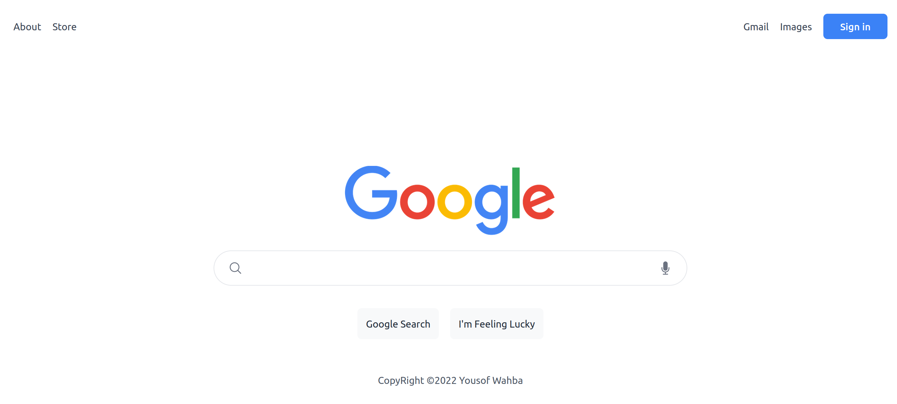
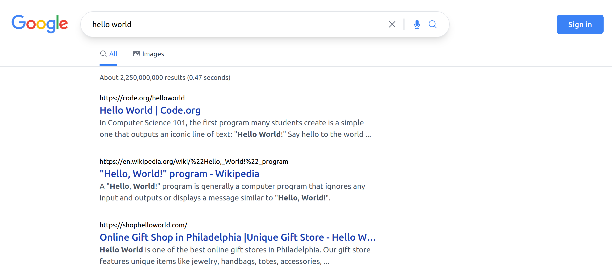
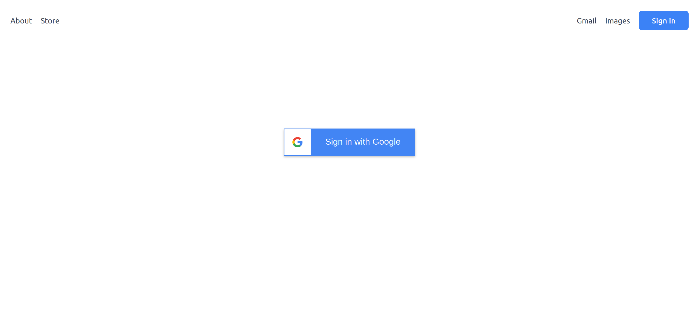
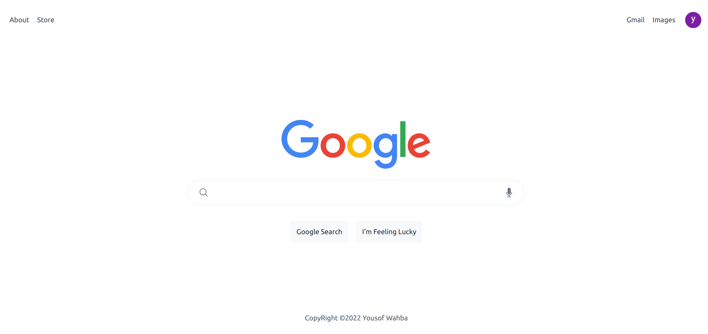
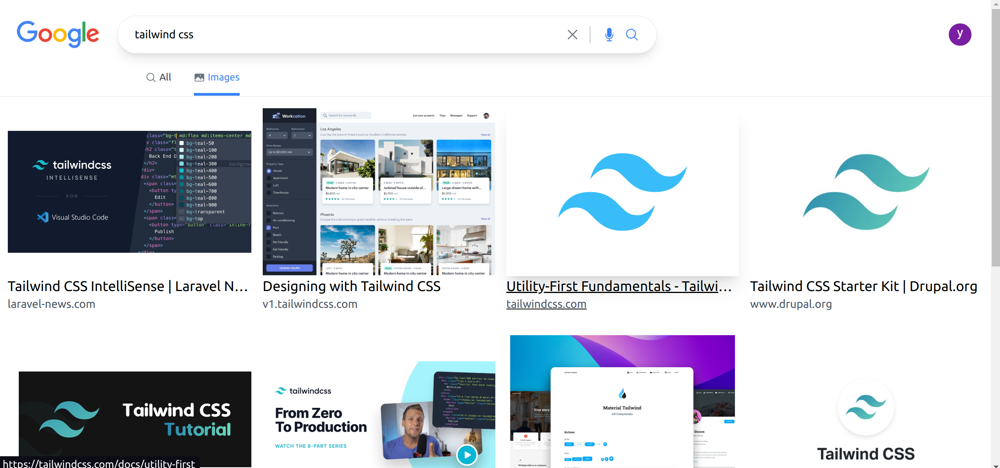

# Google clone

custom search engine using google api and random word api

## Demo 🚀

[preview](https://google-chrome-search.vercel.app/)

## Tech Stack

React, nextjs, TailwindCSS

## Features

- using google api and random word api for lucy button
- support google authentication
- support pagination
- responsive design

## Screenshots

|                                             |                                             |
| ------------------------------------------- | ------------------------------------------- |
|  |  |
|  |  |
|  |  |
|  |  |
